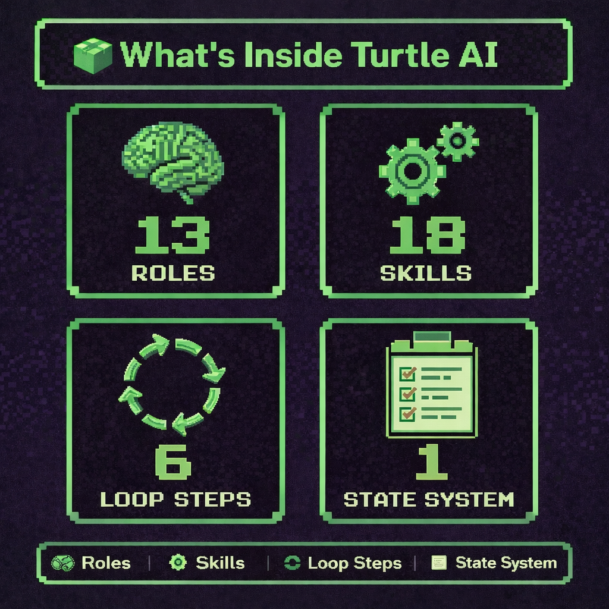

## 🐢 🐢 Turtle AI 🐢 🐢
**Version:** v1.0.0
>Build with AI without losing understanding.

Turtle AI is an AI coding workflow where progress is gated by engineer comprehension, not just code generation. It is designed to preserve engineer understanding, codebase context, and long-term ownership while still using AI to move faster. Most AI coding tools optimize for speed. Turtle AI optimizes for control.

Its key distinction is the **⚙️ IMPLEMENTATION LOOP (Controlled Development Step-by-Step)**:

`EXECUTE → VERIFY → ENGINEER CHECKPOINT → TEST → DEBUG → PLAN STEP UPDATE`

At the center of that loop is **ENGINEER CHECKPOINT**.

This is the comprehension gate. Before work can move forward, the engineer must be able to explain:
- what was implemented
- why it works
- how it fits into the system

That changes the role of AI completely. Instead of turning the engineer into a passive reviewer, Turtle AI keeps the engineer as the source of truth and uses AI as a constrained implementation partner.

This prevents the most common failure mode of AI-assisted development: `the engineer gradually losing real understanding of their own codebase`

Turtle AI keeps changes small, reviewable, and aligned with actual architecture so knowledge compounds instead of decays.

**📦 What's Inside Turtle AI**

🧠 13 Roles (Derived From Worflow)

| Role Type            | Derived From        |
|----------------------|---------------------|
| Planner              | PLAN                |
| Implementer          | EXECUTE             |
| Reviewer             | VERIFY              |
| Comprehension Gate   | ENGINEER CHECKPOINT |
| Tester               | TEST                |
| Debugger             | DEBUG               |
| Security Reviewer    | SECURITY            |
| Performance Reviewer | PERFORMANCE         |
| Documenter           | DOCUMENT            |
| System Architect     | ARCHITECTURE        |
| Rules Engine         | AGENTS              |
| Repo Navigator       | REPO_MAP            |
| Analyzer             | ANALYZE             |

⚙️ 18 Skills

| Skill Name                     | Category        |
|-------------------------------|-----------------|
| turtle-agents                 | Foundation      |
| turtle-architecture           | Foundation      |
| turtle-repo-map               | Foundation      |
| turtle-ideate                 | Discovery       |
| turtle-backlog                | Discovery       |
| turtle-analyze                | Discovery       |
| turtle-plan                   | Planning        |
| turtle-execute                | Implementation  |
| turtle-verify                 | Implementation  |
| turtle-engineer-checkpoint    | Implementation  |
| turtle-test                   | Implementation  |
| turtle-debug                  | Implementation  |
| turtle-plan-step-update       | Implementation  |
| turtle-security               | Hardening       |
| turtle-performance            | Hardening       |
| turtle-backlog-update         | Finalization    |
| turtle-document               | Finalization    |
| turtle-commit                 | Finalization    |

🔁 6 LOOP STEPS

| Step Order | Skill Name                  | Description                                      |
|------------|-----------------------------|--------------------------------------------------|
| 1          | turtle-execute              | Implement the next unchecked plan step           |
| 2          | turtle-verify               | Review correctness and scope                     |
| 3          | turtle-engineer-checkpoint  | Ensure engineer comprehension                    |
| 4          | turtle-test                 | Validate behavior with tests                     |
| 5          | turtle-debug (if needed)    | Diagnose and fix issues                          |
| 6          | turtle-plan-step-update     | Mark step complete after all checks pass         |

📄 1 Plan-Driven State System



## ⚡ Quick Start (30 seconds)

If you're new, start here.  
For a deeper understanding of the workflow, see "How Turtle AI Works" below.

1. Open this repo in Codex
2. Ensure `.agents/skills/` exists
3. Run FOUNDATION once:
   - `/turtle-agents`
   - `/turtle-architecture`
   - `/turtle-repo-map`
4. (Optional) Discovery:
   - `/turtle-ideate` (if you don’t know what to build)
   - `/turtle-backlog` (to create or review features)
   - `/turtle-analyze` (recommended for unfamiliar repos)
5. Pick a feature from `docs/backlog.md`
6. Plan it:
   - `/turtle-plan`
7. Run the loop until complete:
   - `/turtle-execute`
   - `/turtle-verify`
   - `/turtle-engineer-checkpoint`
   - `/turtle-test`
   - `/turtle-debug` (if needed)
   - `/turtle-plan-step-update`
8. Finalize:
   - `/turtle-security`
   - `/turtle-performance`
   - `/turtle-backlog-update`
   - `/turtle-document`
   - `/turtle-commit`

> Tip: The active step is always the first unchecked item in `docs/plans/<feature_slug>_plan.md`.

## ⚡ Codex Skills Support

Turtle AI is fully compatible with **Codex Skills**.

This repository includes a complete set of pre-built skills located in:

```
.agents/skills/
```

These allow you to run the workflow using simple commands like:

```
/turtle-plan
/turtle-execute
/turtle-verify
```

### 🛠️ Codex Setup

Turtle AI runs as a set of Codex Skills located in:

```
.agents/skills/
```

Codex automatically discovers and loads these skills when the repository is opened.

🚨 **Important**
Turtle AI is repo-scoped and requires the `.agents/skills/` directory.

Codex will automatically discover these skills when the repository is opened. If the directory is missing, Turtle commands will not be available.

> Note: Skills follow a deterministic workflow. Always start with FOUNDATION steps before running the implementation loop.

## 🤖 Claude Code Support (Coming Soon)

A version of Turtle AI optimized for **Claude Code** is currently in development.

This will include:
- Native slash command support
- Improved multi-step reasoning workflows
- Enhanced context handling for large repositories

Stay tuned for updates.

## 📚 System Reference

**📂 TARGET PROJECT STRUCTURE AFTER APPLYING TURTLE AI**

This is the recommended structure a project should have after adopting the Turtle AI workflow. It is not the literal file tree of this repository.

    project-root
    │
    ├── .agents/
    │   └── skills/
    │       ├── turtle-agents/
    │       │   └── SKILL.md
    │       ├── turtle-architecture/
    │       │   └── SKILL.md
    │       ├── turtle-repo-map/
    │       │   └── SKILL.md
    │       ├── turtle-ideate/
    │       │   └── SKILL.md
    │       ├── turtle-backlog/
    │       │   └── SKILL.md
    │       ├── turtle-analyze/
    │       │   └── SKILL.md
    │       ├── turtle-plan/
    │       │   └── SKILL.md
    │       ├── turtle-execute/
    │       │   └── SKILL.md
    │       ├── turtle-verify/
    │       │   └── SKILL.md
    │       ├── turtle-engineer-checkpoint/
    │       │   └── SKILL.md
    │       ├── turtle-test/
    │       │   └── SKILL.md
    │       ├── turtle-debug/
    │       │   └── SKILL.md
    │       ├── turtle-plan-step-update/
    │       │   └── SKILL.md
    │       ├── turtle-security/
    │       │   └── SKILL.md
    │       ├── turtle-performance/
    │       │   └── SKILL.md
    │       ├── turtle-backlog-update/
    │       │   └── SKILL.md
    │       ├── turtle-document/
    │       │   └── SKILL.md
    │       └── turtle-commit/
    │           └── SKILL.md
    │
    ├── docs/
    │   ├── analysis/
    │   │   └── repo_analysis.md
    │   │
    │   ├── system/
    │   │   └── current_step_detector.md
    │   │
    │   ├── backlog.md
    │   │
    │   ├── plans/
    │   │   └── <feature_slug>_plan.md
    │   │
    │   └── features/
    │       └── <feature_slug>.md
    │
    ├── agents.md
    ├── architecture.md
    └── repo_map.md

Folder purposes:
- .agents/skills/ = Codex skills that execute the Turtle AI workflow
- turtle_prompts/ = source prompts for each Turtle AI workflow step
- docs/analysis/ = repo understanding
- docs/system/ = shared workflow rules
- docs/plans/ = active feature execution state
- docs/features/ = final feature records

---

**⚙️ SKILLS**

**🧱 FOUNDATION (Static Context)**

    1️⃣ /turtle-agents
    Project rules and safety constraints. Prevents AI from violating conventions.

    2️⃣ /turtle-architecture
    System blueprint.
    Defines how the system is structured and what patterns should be preserved.

    3️⃣ /turtle-repo-map
    High-level navigation of the repo, protected paths, critical modules,  
    and important file locations.

**💡 DISCOVERY (Problem + Opportunity)**

    4️⃣ /turtle-ideate
    Generate or explore potential features when direction is unclear

    5️⃣ /turtle-backlog
    Persist and prioritize features in docs/backlog.md

    6️⃣ /turtle-analyze
    Build a working mental model of the repository
    Use when entering unfamiliar code or when context is missing


**🧭 PLANNING (Architecture + Scope)**

    7️⃣ /turtle-plan
    Architect chosen feature → docs/plans/<feature_slug>_plan.md

**⚙️ IMPLEMENTATION LOOP (Controlled Development Step-by-Step)**
This loop runs repeatedly until all plan steps are complete.

    8️⃣ /turtle-execute EXECUTE
    Implement only the next unchecked task from the plan

    9️⃣ /turtle-verify VERIFY
    AI performs code review of correctness and scope

    🔟 /turtle-engineer-checkpoint
    Engineer comprehension checkpoint

    1️⃣1️⃣ /turtle-test
    Two-phase step:

    A. TEST REVIEW
    - Determine the smallest correct set of tests required for the current active plan step

    B. TEST IMPLEMENTATION
    - Implement ONLY the tests identified in TEST REVIEW

    1️⃣2️⃣ /turtle-debug
    Two-phase step:

    A. DEBUG / DIAGNOSE
    - Identify root cause of failure from VERIFY, TEST, ENGINEER CHECKPOINT, or runtime

    B. DEBUG FIX / APPLY
    - Apply ONLY the minimal fix identified in Diagnose mode

    Diagnose issues and route fixes to the correct layer (EXECUTE or TEST).  
    only if something fails

    1️⃣3️⃣ /turtle-plan-step-update (REQUIRED) ✅
    This step is NOT optional. MUST run after every successful loop.  
    A step is NOT complete until this executes


**🛡️ HARDENING (Quality Gates)**

    1️⃣4️⃣ /turtle-security
    Run focused security review for new or changed behavior

    1️⃣5️⃣ /turtle-performance
    Run targeted performance review when the feature affects performance-sensitive paths

**🚀 FINALIZATION (Ship + Record)**

    1️⃣6️⃣ /turtle-backlog-update
    Mark feature complete

    1️⃣7️⃣ /turtle-document
    Capture architectural decisions inside the repo
    Note: Run after the feature is complete, not after every step

    1️⃣8️⃣ /turtle-commit
    Prepare commit message only

***

**🌐 GLOBAL RULES**

**Current Step Detector Pattern**

    Use the plan file as the source of truth for workflow state:

    docs/plans/<feature_slug>_plan.md

    Step state rules
    - The active loop step = the first unchecked step:
    - - [ ]
    - The last completed step = the most recently checked step:
    - the last - [x]
    - The plan is complete when no unchecked steps remain

    Detection rules

    Every prompt that needs step state must determine. 
    it from the plan file instead of asking for manual step input.

    Use this pattern:
    1. Read docs/plans/<feature_slug>_plan.md
    2. Find all checklist items
    3. For EXECUTE, VERIFY, ENGINEER CHECKPOINT, TEST, and DEBUG on active work:
    - use the first unchecked step - [ ]
    4. For prompts that operate on already-completed work after loop completion:
    - use the most recently checked step - [x]
    5. If no unchecked steps remain:
    - treat the plan as complete
    - stop or move to FINALIZATION as appropriate

    Manual input rule
    - Do NOT ask for current step name or number if it can be derived from the plan file
    - The plan file is the single source of truth for step progression

    🗄️ STATE MODEL:
    This workflow is plan-driven. The plan file controls all execution state.
    Use the CURRENT STEP DETECTOR PATTERN to derive workflow state from:
    docs/plans/<feature_slug>_plan.md

**State Reconciliation Rule**

    If the FIRST unchecked step already appears implemented in the working tree:

    - EXECUTE may return: already_satisfied
    - This does NOT mark the step complete
    - VERIFY must review the existing repo state for that step
    - TEST still runs if applicable
    - PLAN STEP UPDATE remains the ONLY step allowed to change [ ] → [x]

    Purpose:
    Prevent workflow deadlocks when repo state already satisfies the current unchecked step but plan state has not yet been updated.

**Step State Invariant (CRITICAL)**

    Throughout the execution loop:

    - The active step ALWAYS remains unchecked (- [ ])
    - A step is ONLY marked complete (- [x]) after:
    EXECUTE → VERIFY → ENGINEER CHECKPOINT → TEST → DEBUG (if needed) → PLAN STEP UPDATE

    This means:
    - EXECUTE, VERIFY, ENGINEER CHECKPOINT, and TEST ALL operate on:
    → the FIRST unchecked step (- [ ])

    - PLAN STEP UPDATE is the ONLY step allowed to:
    → change [ ] → [x]

    Violation of this rule breaks workflow state consistency.


**Debug Routing Rule**
    DEBUG does NOT automatically mean "fix the code".

    Always route based on root cause:
    → EXECUTE (DEBUG FIX) — code issue
    → EXECUTE (VERIFY FIX MODE) — plan mismatch
    → TEST — test issue

    Always fix the correct layer. Never mix layers.

    ┌─────────────────────────────────────────────────────┐
    │ Root Cause              → Route To                  │
    ├─────────────────────────────────────────────────────┤
    │ Code is wrong           → EXECUTE (DEBUG FIX)       │
    │ Code doesn't match plan → EXECUTE (VERIFY FIX MODE) │
    │ Tests are wrong         → TEST                      │
    │ Unclear / mixed         → EXECUTE (DEBUG FIX)       │
    └─────────────────────────────────────────────────────┘

    Never fix the wrong layer.

**Engineer Checkpoint Rule (CRITICAL)**

    ENGINEER CHECKPOINT is a required comprehension gate before moving forward.

    The engineer must be able to:
    - explain what was implemented
    - explain why it works
    - explain how it fits into the system

    If the engineer cannot confidently answer:
    - STOP the workflow
    - do NOT proceed to TEST or PLAN STEP UPDATE
    - revisit the implementation

    Rules:
    - This step enforces understanding, not correctness
    - Passing VERIFY does NOT guarantee passing ENGINEER CHECKPOINT
    - The engineer is the source of truth, not the AI

    Purpose:
    Prevent passive approval of code and ensure long-term ownership of the system.

**🔁 CORE EXECUTION LOOP (Step-by-Step)**
    This loop runs repeatedly until all plan steps are complete.

    1. EXECUTE — implement one scoped step
    2. VERIFY — review correctness and scope
    3. ENGINEER CHECKPOINT — confirm understanding
    4. TEST — validate behavior
    5. DEBUG — only if something fails
    6. PLAN STEP UPDATE (REQUIRED) ✅
    - This step is NOT optional
    - MUST run after every successful loop
    - A step is NOT complete until this executes

***
