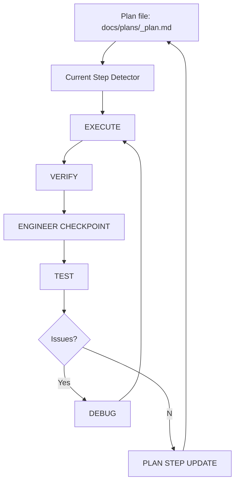

## 🐢 🐢 Turtle AI 🐢 🐢
**Version:** v1.0.0
>Build with AI without losing understanding.

Turtle AI is an AI coding workflow where progress is gated by engineer comprehension, not just code generation. It is designed to preserve engineer understanding, codebase context, and long-term ownership while still using AI to move faster. Most AI coding tools optimize for speed. Turtle AI optimizes for control.

Its key distinction is the **⚙️ IMPLEMENTATION LOOP (Controlled Development Step-by-Step)**:

`EXECUTE → VERIFY → ENGINEER CHECKPOINT → TEST → DEBUG → PLAN STEP UPDATE`

At the center of that loop is **ENGINEER CHECKPOINT**.

This is the comprehension gate. Before work can move forward, the engineer must be able to explain:
- what was implemented
- why it works
- how it fits into the system

That changes the role of AI completely. Instead of turning the engineer into a passive reviewer, Turtle AI keeps the engineer as the source of truth and uses AI as a constrained implementation partner.

This prevents the most common failure mode of AI-assisted development: `the engineer gradually losing real understanding of their own codebase`

Turtle AI keeps changes small, reviewable, and aligned with actual architecture so knowledge compounds instead of decays.

**📦 What's Inside Turtle AI**


### 🧠 13 Roles (Derived From Workflow)

| Role Type            | Derived From        |
|----------------------|---------------------|
| Planner              | PLAN                |
| Implementer          | EXECUTE             |
| Reviewer             | VERIFY              |
| Comprehension Gate   | ENGINEER CHECKPOINT |
| Tester               | TEST                |
| Debugger             | DEBUG               |
| Security Reviewer    | SECURITY            |
| Performance Reviewer | PERFORMANCE         |
| Documenter           | DOCUMENT            |
| System Architect     | ARCHITECTURE        |
| Rules Engine         | AGENTS              |
| Repo Navigator       | REPO_MAP            |
| Analyzer             | ANALYZE             |

### ⚙️ 18 Skills

| Skill Name                     | Category        |
|-------------------------------|-----------------|
| turtle-agents                 | Foundation      |
| turtle-architecture           | Foundation      |
| turtle-repo-map               | Foundation      |
| turtle-ideate                 | Discovery       |
| turtle-backlog                | Discovery       |
| turtle-analyze                | Discovery       |
| turtle-plan                   | Planning        |
| turtle-execute                | Implementation  |
| turtle-verify                 | Implementation  |
| turtle-engineer-checkpoint    | Implementation  |
| turtle-test                   | Implementation  |
| turtle-debug                  | Implementation  |
| turtle-plan-step-update       | Implementation  |
| turtle-security               | Hardening       |
| turtle-performance            | Hardening       |
| turtle-backlog-update         | Finalization    |
| turtle-document               | Finalization    |
| turtle-commit                 | Finalization    |

### 🔁 6 Loop Steps

| Step Order | Skill Name                  | Description                                      |
|------------|-----------------------------|--------------------------------------------------|
| 1          | turtle-execute              | Implement the next unchecked plan step           |
| 2          | turtle-verify               | Review correctness and scope                     |
| 3          | turtle-engineer-checkpoint  | Ensure engineer comprehension                    |
| 4          | turtle-test                 | Validate behavior with tests                     |
| 5          | turtle-debug (if needed)    | Diagnose and fix issues                          |
| 6          | turtle-plan-step-update     | Mark step complete after all checks pass         |

### 📄 1 Plan-Driven State System

The Plan-Driven State System is the control layer of Turtle AI.

All workflow state is derived from a single source of truth:

docs/plans/<feature_slug>_plan.md

Instead of tracking progress manually, Turtle AI determines:
- the current step
- the next action
- completion status

by reading the plan file.

This ensures:
- deterministic execution
- no hidden state
- consistent progress tracking across all steps

| Concept | Description |
|--------|-------------|
| Source of Truth | `docs/plans/<feature_slug>_plan.md` |
| Active Step | First unchecked `[ ]` item |
| Completed Step | Most recent `[x]` item |
| Step Transition | Only via `turtle-plan-step-update` |
| Completion Condition | No `[ ]` items remain |
| State Ownership | Controlled by the plan file, not the user |


**State Flow Overview**



## ⚡ Quick Start (30 seconds)

If you're new, start here.  
For a deeper understanding of the workflow, see the System Reference below.

1. Open this repo in Codex
2. Ensure `.agents/skills/` exists
3. Run FOUNDATION once:
   - `/turtle-agents`
   - `/turtle-architecture`
   - `/turtle-repo-map`
4. (Optional) Discovery:
   - `/turtle-ideate` (if you don’t know what to build)
   - `/turtle-backlog` (to create or review features)
   - `/turtle-analyze` (recommended for unfamiliar repos)
5. Pick a feature from `docs/backlog.md`
6. Plan it:
   - `/turtle-plan`
7. Run the loop until complete:
   - `/turtle-execute`
   - `/turtle-verify`
   - `/turtle-engineer-checkpoint`
   - `/turtle-test`
   - `/turtle-debug` (if needed)
   - `/turtle-plan-step-update`
8. Finalize:
   - `/turtle-security`
   - `/turtle-performance`
   - `/turtle-backlog-update`
   - `/turtle-document`
   - `/turtle-commit`

> Tip: The active step is always the first unchecked item in `docs/plans/<feature_slug>_plan.md`.

## ⚡ Codex Skills Support

Turtle AI is fully compatible with **Codex Skills** and runs as a repo-scoped skill set located in:

```
.agents/skills/
```

Once the repository is opened, Codex discovers these skills automatically, making commands like these available:

```
/turtle-plan
/turtle-execute
/turtle-verify
```

> Important: Turtle AI requires the `.agents/skills/` directory. If it is missing, Turtle commands will not be available.
>
> Note: Always start with the FOUNDATION steps before entering the implementation loop.

## 📚 System Reference

**📂 TARGET PROJECT STRUCTURE AFTER APPLYING TURTLE AI**

This is the recommended structure a project should have after adopting the Turtle AI workflow. It is not the literal file tree of this repository.

    project-root
    │
    ├── .agents/
    │   └── skills/
    │       ├── turtle-agents/
    │       │   └── SKILL.md
    │       ├── turtle-architecture/
    │       │   └── SKILL.md
    │       ├── turtle-repo-map/
    │       │   └── SKILL.md
    │       ├── turtle-ideate/
    │       │   └── SKILL.md
    │       ├── turtle-backlog/
    │       │   └── SKILL.md
    │       ├── turtle-analyze/
    │       │   └── SKILL.md
    │       ├── turtle-plan/
    │       │   └── SKILL.md
    │       ├── turtle-execute/
    │       │   └── SKILL.md
    │       ├── turtle-verify/
    │       │   └── SKILL.md
    │       ├── turtle-engineer-checkpoint/
    │       │   └── SKILL.md
    │       ├── turtle-test/
    │       │   └── SKILL.md
    │       ├── turtle-debug/
    │       │   └── SKILL.md
    │       ├── turtle-plan-step-update/
    │       │   └── SKILL.md
    │       ├── turtle-security/
    │       │   └── SKILL.md
    │       ├── turtle-performance/
    │       │   └── SKILL.md
    │       ├── turtle-backlog-update/
    │       │   └── SKILL.md
    │       ├── turtle-document/
    │       │   └── SKILL.md
    │       └── turtle-commit/
    │           └── SKILL.md
    │
    ├── docs/
    │   ├── analysis/
    │   │   └── repo_analysis.md
    │   │
    │   ├── system/
    │   │   └── current_step_detector.md
    │   │
    │   ├── backlog.md
    │   │
    │   ├── plans/
    │   │   └── <feature_slug>_plan.md
    │   │
    │   └── features/
    │       └── <feature_slug>.md
    │
    ├── agents.md
    ├── architecture.md
    └── repo_map.md

Folder purposes:

| Folder / File        | Purpose                                                      |
|---------------------|--------------------------------------------------------------|
| `.agents/skills/`   | Codex skills that execute the Turtle AI workflow             |
| `docs/analysis/`    | Repository understanding and system insights                 |
| `docs/system/`      | Shared workflow rules (e.g., step detection)                 |
| `docs/backlog.md`   | Feature backlog and prioritization                           |
| `docs/plans/`       | Active feature execution state                               |
| `docs/features/`    | Finalized feature records and outcomes                       |

---

**⚙️ TURTLE AI CODING WORKFLOW**

| Phase | Step | Skill | Purpose |
|------|------|------|--------|
| 🧱 Foundation | 1 | turtle-agents | Define rules and constraints |
| 🧱 Foundation | 2 | turtle-architecture | Define system structure |
| 🧱 Foundation | 3 | turtle-repo-map | Map repo and key modules |
| 💡 Discovery | 4 | turtle-ideate | Explore feature ideas |
| 💡 Discovery | 5 | turtle-backlog | Store and prioritize work |
| 💡 Discovery | 6 | turtle-analyze | Understand the codebase |
| 🧭 Planning | 7 | turtle-plan | Create implementation plan |
| ⚙️ Loop | 8–13 | multiple | Execute step-by-step loop |
| 🛡️ Hardening | 14–15 | security/performance | Validate quality |
| 🚀 Finalization | 16–18 | finalize skills | Ship and record |

---

**🧱 FOUNDATION (Static Context)**

    1️⃣ /turtle-agents
    Project rules and safety constraints. Prevents AI from violating conventions.

    2️⃣ /turtle-architecture
    System blueprint.
    Defines how the system is structured and what patterns should be preserved.

    3️⃣ /turtle-repo-map
    High-level navigation of the repo, protected paths, critical modules,  
    and important file locations.

**💡 DISCOVERY (Problem + Opportunity)**

    4️⃣ /turtle-ideate
    Generate or explore potential features when direction is unclear

    5️⃣ /turtle-backlog
    Persist and prioritize features in docs/backlog.md

    6️⃣ /turtle-analyze
    Build a working mental model of the repository
    Use when entering unfamiliar code or when context is missing


**🧭 PLANNING (Architecture + Scope)**

    7️⃣ /turtle-plan
    Architect chosen feature → docs/plans/<feature_slug>_plan.md

**⚙️ IMPLEMENTATION LOOP (Controlled Development Step-by-Step)**

    8️⃣ /turtle-execute EXECUTE
    Implement only the next unchecked task from the plan

    9️⃣ /turtle-verify VERIFY
    AI performs code review of correctness and scope

    🔟 /turtle-engineer-checkpoint
    Engineer comprehension checkpoint

    1️⃣1️⃣ /turtle-test
    Two-mode step:

    A. TEST MODE A — REVIEW
    - Identify the smallest correct set of tests required for the current active plan step
    - Determine whether existing tests already cover the behavior
    - Do NOT write or modify tests in this mode

    B. TEST MODE B — IMPLEMENT
    - Write or update ONLY the tests identified in Review mode
    - Keep test scope limited to the current active plan step
    - Follow existing test patterns and conventions in the repo

    Rules:
    - Always run Mode A before Mode B
    - Do not write tests for future plan steps
    - Do not change production code in this step
    - Prefer the smallest correct test set

    Purpose:
    Separate test planning from test writing so test coverage stays scoped, intentional, and aligned with the current plan step

    1️⃣2️⃣ /turtle-debug
    Two-mode step:

    A. DEBUG MODE A — DIAGNOSE
    - Identify the root cause of the failure
    - Determine whether the issue is in code, plan alignment, or tests
    - Do NOT apply fixes in this mode

    B. DEBUG MODE B — APPLY FIX
    - Apply ONLY the minimal fix identified in Diagnose mode
    - Fix the correct layer (code or tests)
    - Do NOT introduce new scope or changes

    Rules:
    - Always run Mode A before Mode B
    - Never skip diagnosis
    - Do not fix multiple layers at once

    Purpose:
    Separate thinking from fixing to avoid incorrect or rushed changes

    Only run DEBUG if something fails in EXECUTE, VERIFY, ENGINEER CHECKPOINT, or TEST.

    1️⃣3️⃣ /turtle-plan-step-update (REQUIRED) ✅
    This step is NOT optional. MUST run after every successful loop.  
    A step is NOT complete until this executes


**🛡️ HARDENING (Quality Gates)**

    1️⃣4️⃣ /turtle-security
    Run focused security review for new or changed behavior

    1️⃣5️⃣ /turtle-performance
    Run targeted performance review when the feature affects performance-sensitive paths

**🚀 FINALIZATION (Ship + Record)**

    1️⃣6️⃣ /turtle-backlog-update
    Mark feature complete

    1️⃣7️⃣ /turtle-document
    Capture architectural decisions inside the repo
    Note: Run after the feature is complete, not after every step

    1️⃣8️⃣ /turtle-commit
    Prepare commit message only

***

**🌐 GLOBAL RULES**

**Current Step Detector Pattern**

Use this pattern:
1. Read `docs/plans/<feature_slug>_plan.md`
2. Find all checklist items
3. The active step is the first unchecked `[ ]` item
4. For EXECUTE, VERIFY, ENGINEER CHECKPOINT, TEST, and DEBUG on active work, operate on that first unchecked step
5. For prompts acting on completed work after loop completion, use the most recently checked `[x]` item
6. If no unchecked steps remain, treat the plan as complete and move to FINALIZATION as appropriate

Manual input rule:
- Do not ask for the current step if it can be derived from the plan file

**State Reconciliation Rule**

If the FIRST unchecked step already appears implemented in the working tree:

| Condition | Behavior |
|----------|----------|
| Step already implemented in code | EXECUTE may return `already_satisfied` |
| Step appears complete but not marked | Step remains unchecked `[ ]` |
| Verification required | VERIFY must review existing implementation |
| Testing required | TEST still runs if applicable |
| State update | Only `turtle-plan-step-update` can change `[ ] → [x]` |

Rules:
- Do not mark steps complete based on code alone
- Always pass through VERIFY and TEST before updating state
- Never skip PLAN STEP UPDATE

Purpose:
Prevent workflow deadlocks and ensure the plan file remains the single source of truth even when code and plan state are temporarily out of sync.

**Step State Invariant (CRITICAL)**

| Constraint | Description |
|-----------|-------------|
| Active step remains unchecked | The current step ALWAYS stays as `[ ]` during the loop |
| Completion gating | A step is ONLY marked `[x]` after the full loop passes |
| Loop order enforcement | EXECUTE → VERIFY → ENGINEER CHECKPOINT → TEST → DEBUG (if needed) → PLAN STEP UPDATE |
| Single write authority | Only `turtle-plan-step-update` can change `[ ] → [x]` |
| Scope of work | EXECUTE, VERIFY, ENGINEER CHECKPOINT, and TEST operate on the FIRST unchecked step |

Rules:
- Never mark a step complete during EXECUTE, VERIFY, ENGINEER CHECKPOINT, TEST, or DEBUG
- Always complete the full loop before updating plan state
- Do not skip any stage in the loop

Purpose:
Guarantee consistent state progression and prevent partial or invalid step completion that could corrupt workflow state.


**Debug Routing Rule (Simple)**

When something fails, first identify what is actually wrong:

| What’s wrong? | What to fix |
|--------------|------------|
| The code is incorrect | Fix the code (EXECUTE) |
| The implementation doesn’t match the plan | Adjust the code to match the plan |
| The test is incorrect | Fix the test (TEST) |

Rules:
- Do not guess — identify the root cause first
- Do not change multiple layers at once
- Fix only what is actually broken

Purpose:
Ensure problems are fixed at the correct layer instead of masking issues.

**Engineer Checkpoint Rule (CRITICAL)**

    ENGINEER CHECKPOINT is a required comprehension gate before moving forward.

    The engineer must be able to:
    - explain what was implemented
    - explain why it works
    - explain how it fits into the system

    If the engineer cannot confidently answer:
    - STOP the workflow
    - do NOT proceed to TEST or PLAN STEP UPDATE
    - revisit the implementation

    Rules:
    - This step enforces understanding, not correctness
    - Passing VERIFY does NOT guarantee passing ENGINEER CHECKPOINT
    - The engineer is the source of truth, not the AI

    Purpose:
    Prevent passive approval of code and ensure long-term ownership of the system.

**🔁 CORE EXECUTION LOOP (Step-by-Step)**

| Step | Name | What Happens | Gate Type |
|------|------|--------------|-----------|
| 1 | EXECUTE | Implement one scoped plan step | Build |
| 2 | VERIFY | Review correctness and scope | Quality |
| 3 | ENGINEER CHECKPOINT | Ensure engineer understanding | 🧠 Comprehension |
| 4 | TEST | Review required tests, then implement the smallest correct test set | Validation |
| 5 | DEBUG | Diagnose the root cause first, then apply the minimal correct fix if needed | Recovery |
| 6 | PLAN STEP UPDATE | Mark step complete only after all checks pass | State Control |

---

This loop runs repeatedly until all plan steps are complete.

Key rules:
- Always follow the sequence: EXECUTE → VERIFY → ENGINEER CHECKPOINT → TEST → DEBUG (if needed) → PLAN STEP UPDATE
- PLAN STEP UPDATE is REQUIRED — a step is not complete until this runs
- Never skip ENGINEER CHECKPOINT — understanding is mandatory before moving forward

***
