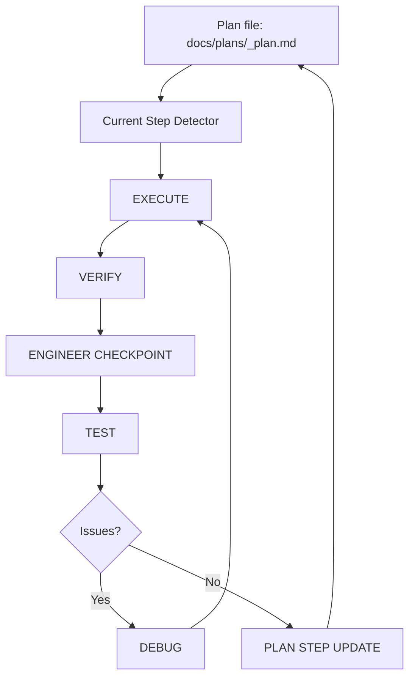

# Turtle AI State System

The Plan-Driven State System is the control layer of Turtle AI.

All workflow state is derived from one source of truth:

```text
docs/plans/<feature_slug>_plan.md
```

Instead of tracking progress manually, Turtle AI determines the current step, next action, and completion status by reading the plan file.

## State Concepts

| Concept | Description |
| --- | --- |
| Source of truth | `docs/plans/<feature_slug>_plan.md` |
| Active step | First unchecked `[ ]` item |
| Completed step | Most recent checked `[x]` item |
| Step transition | Only via `turtle-plan-step-update` |
| Completion condition | No unchecked `[ ]` items remain |
| State ownership | Controlled by the plan file |

## State Flow



## Current Step Detector Pattern

1. Read `docs/plans/<feature_slug>_plan.md`.
2. Find all checklist items.
3. Treat the first unchecked `[ ]` item as the active step.
4. For `EXECUTE`, `VERIFY`, `ENGINEER CHECKPOINT`, `TEST`, and `DEBUG`, operate on the first unchecked step.
5. For prompts acting on completed work after loop completion, use the most recently checked `[x]` item.
6. If no unchecked steps remain, treat the plan as complete and move to finalization as appropriate.

Do not ask for the current step if it can be derived from the plan file.

## State Reconciliation

If the first unchecked step already appears implemented in the working tree, the plan still controls state.

| Condition | Behavior |
| --- | --- |
| Step already implemented in code | `EXECUTE` may return `already_satisfied`. |
| Step appears complete but is not marked | The step remains unchecked `[ ]`. |
| Verification required | `VERIFY` must review the existing implementation. |
| Testing required | `TEST` still runs if applicable. |
| State update | Only `turtle-plan-step-update` can change `[ ]` to `[x]`. |

Rules:

- Do not mark steps complete based on code alone.
- Always pass through `VERIFY` and `TEST` before updating state.
- Never skip `PLAN STEP UPDATE`.

This prevents workflow deadlocks and keeps the plan file as the single source of truth when code and plan state are temporarily out of sync.
